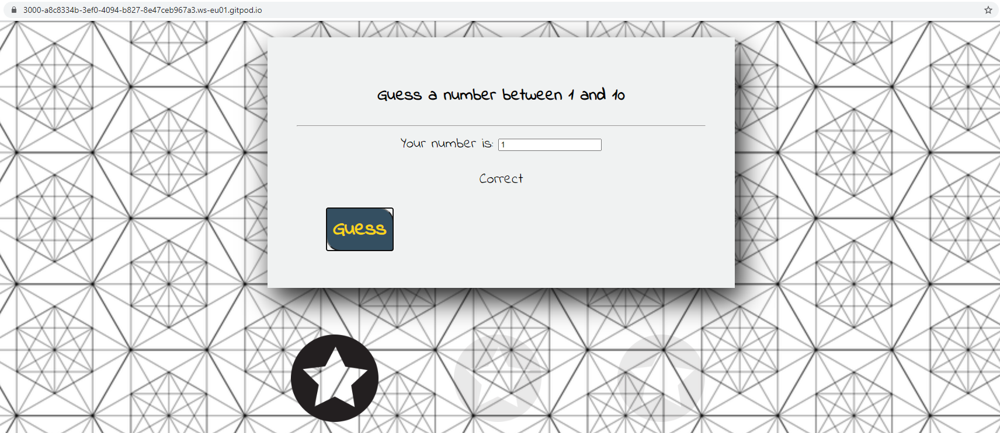

# JavaScript Guessing Game
This is a simple JavaScript game where the player has to guess a number. 


##Build with


- [Node.js](https://nodejs.org/en/)
- [Express](https://expressjs.com/)
- [JavaScript](https://www.javascript.com/)
- CSS
- HTML

## To run this application on GitPod follow next steps 

#### 1. Open GitPod workspace for your repository
Enter https://gitpod.io/#yourRepositoryLink in a browser. It can take few minutes to load

#### 2. Clone current repository
```linux
git clone https://github.com/AnyaKarpiuk/JavaScriptGuessingGame.git
```

#### 3. Install dependencies (if they aren't there)
```linux
npm install
```

#### 4. Run the development server
```linux
npm run dev
```

:+1:
